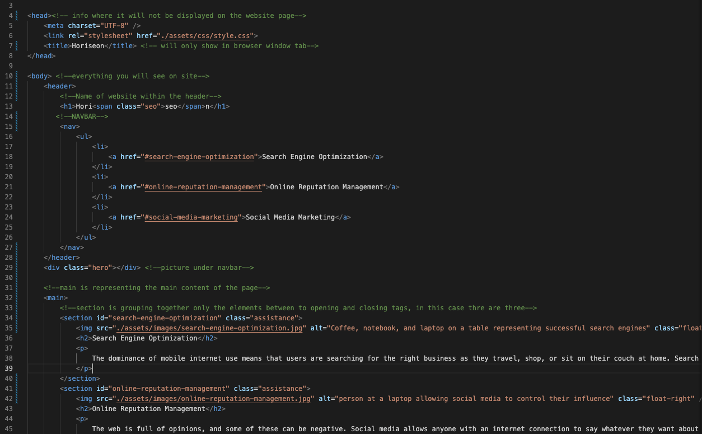

# Horiseon Accessibility Site

## Description

Horiseon Marketing Agency needed a codebase that follows accessibility standards so it is optimized for search engines. Throughout this project I learned the proper usage of semantic HTML elements and how it effects SEO. Also learned how to consolidate CSS selectors that follow the format of the HTML document for better organization.

## Installation

N/A

## Usage

This website can now be used normally with the proper addition of semantically accessible HTML elements.

## Credits

N/A

## License

NONE
